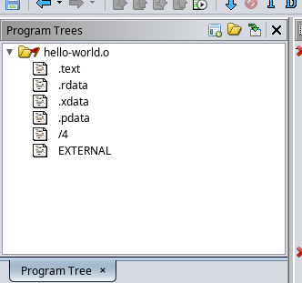
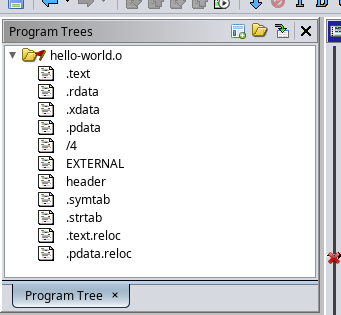
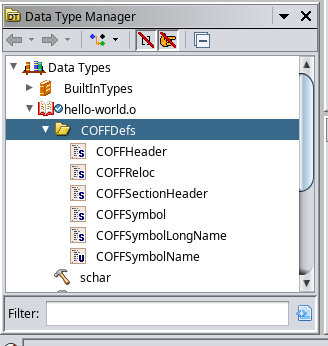

# Ghidra COFF Parser

Ghidra script which fully parses COFF files.

# Installation
Basic install.

Download the script into the `~/ghidra_scripts` directory.

```bash
$ mkdir ~/ghidra_scripts
$ curl -L https://raw.githubusercontent.com/MEhrn00/Ghidra_COFFParser/main/COFFParser.py -o ~/ghidra_scripts/COFFParser.py
```

In the `Windows -> Script Manager` menu of the CodeBrowser tool, select the `In Tool`
check box under `Scripts -> Analysis -> COFFParser.py`. (May need to refresh the script
list by clicking the `Refresh Script List` button in the top right corner.

COFF files can be analyzed from the `Analysis -> One Shot -> COFF Parser` in the menu bar
after normal Ghidra analysis.

# Features
 * Adds COFF type definitions
 * Maps in the COFF header, string table, symbol table and any section relocation tables
 * Performs relocations across the file and adds xrefs

# Example

### Before

Ghidra only parses a few sections and excludes all of the headers.

<p align="center">
  
</p>


---

### After

Headers and other metadata are mapped in.

<p align="center">
  
</p>


COFF metadata includes correct types and relocations.

<p align="center">
  
</p>


COFF types added to the Ghidra data type manager under `Data Types/[program name]/COFFDefs`.

<p align="center">
  
</p>


# Disclaimer

This hasn't been tested thoroughly so there may be bugs.
